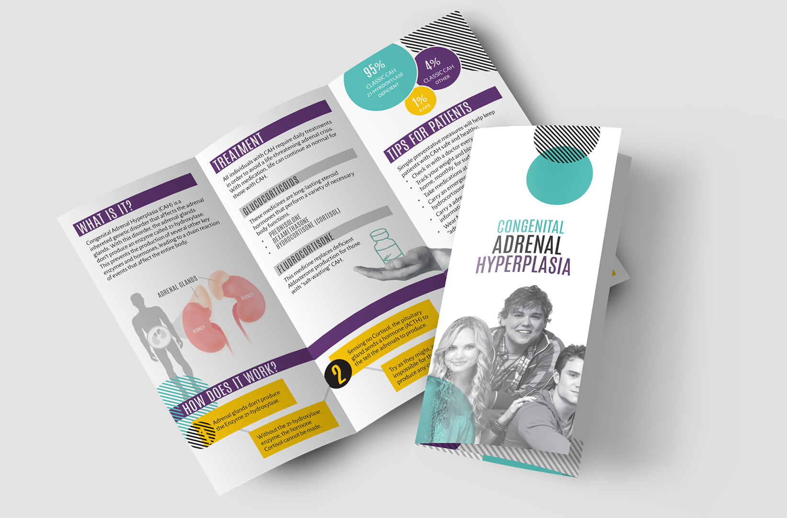
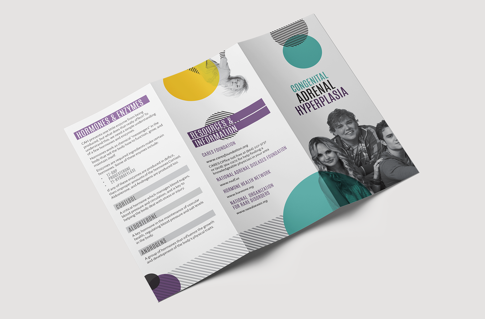
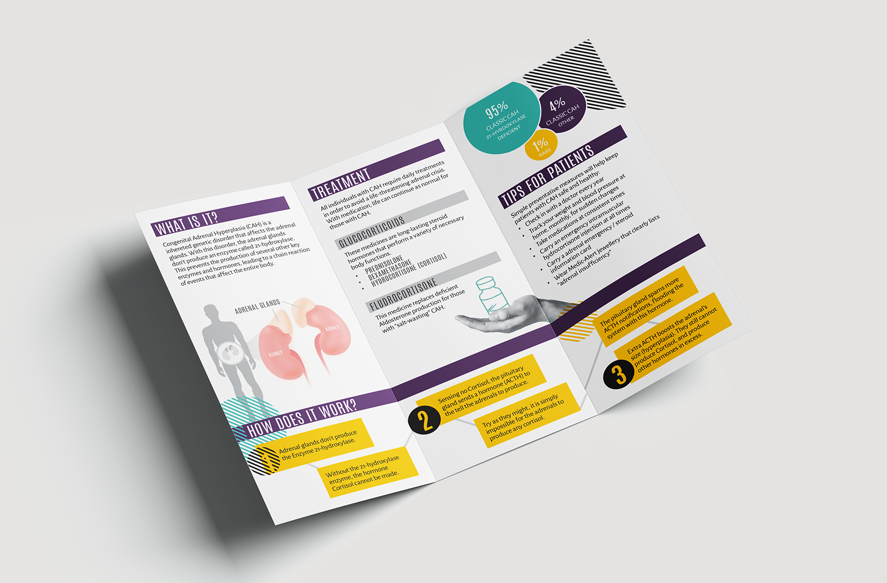
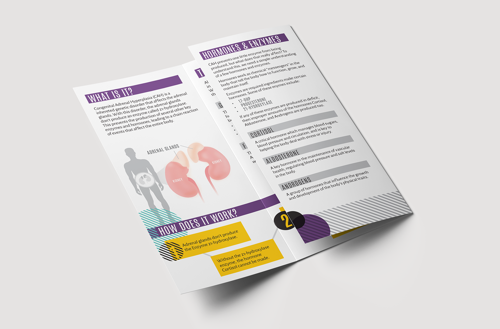
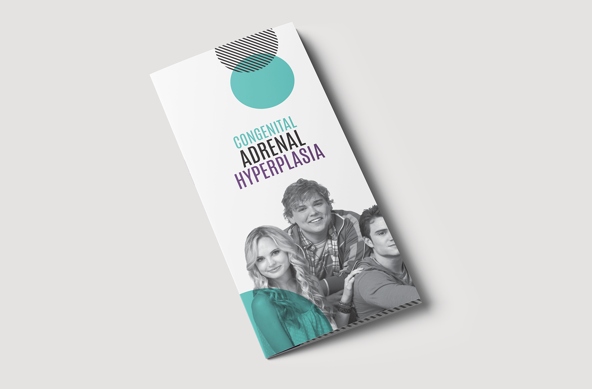

#### CAH Brochure

Congenital Adrenal Hyperplasia (CAH) is a rare genetic disorder that affects adrenal function. Trying to explain it without medical jargon and several technical chemical components is difficult. I created this design to help doctors and patients more simply explain the condition to others, and understand it themselves. If you or someone you know would benefit from the use of this brochure you can [download](https://www.dropbox.com/s/f6b7fx2h4nwgrif/CAH_Brochure-Free_Download-R_Taylor_Design.zip?dl=0) the file for personal or educational use.

**Role** Graphic Designer, Copywriter  
**For** Self-Promotion  
**Type** Print Media

  
  
  
  

