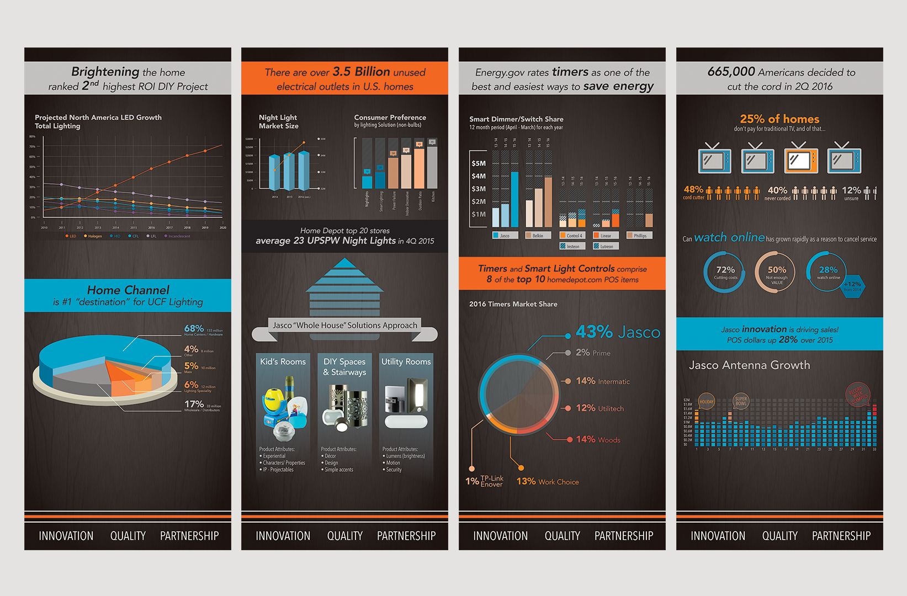
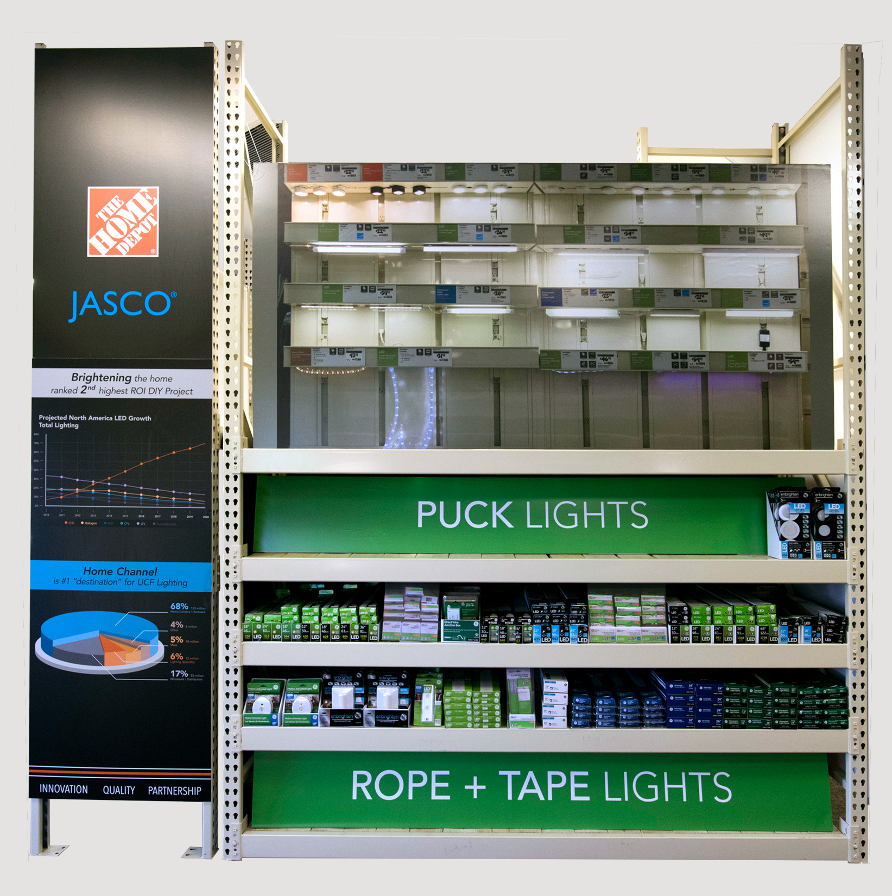
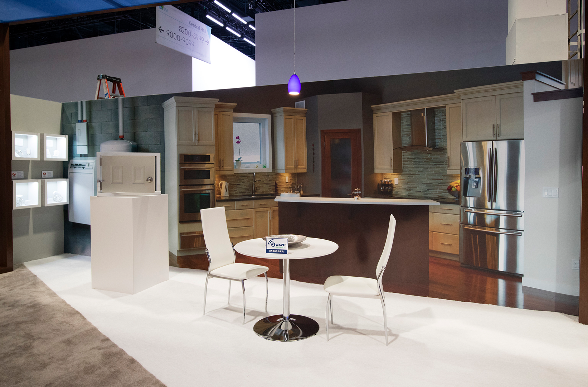
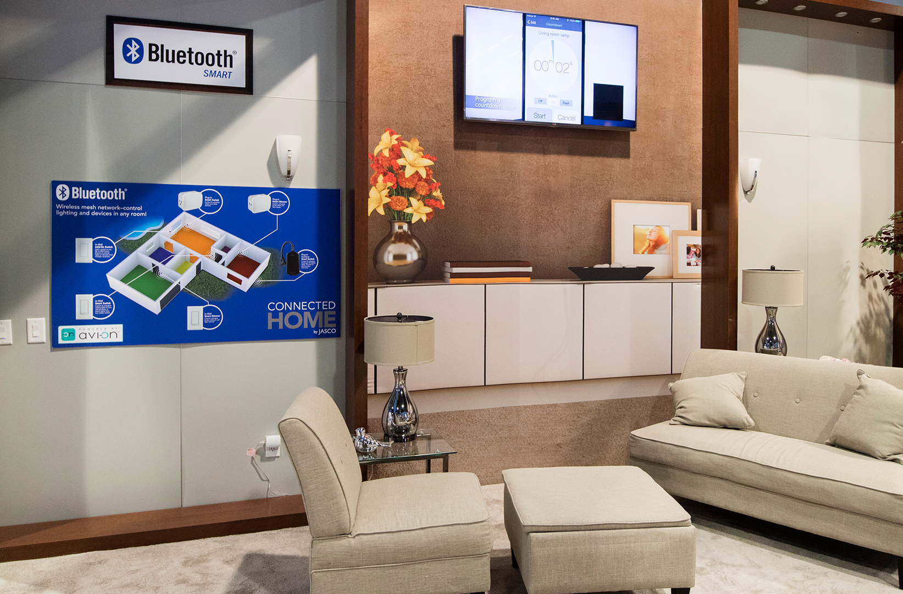
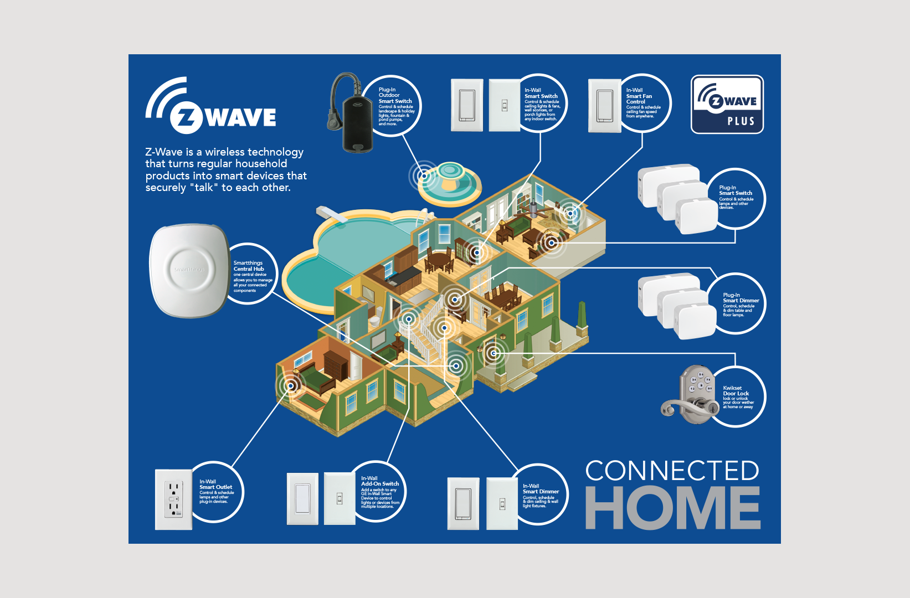
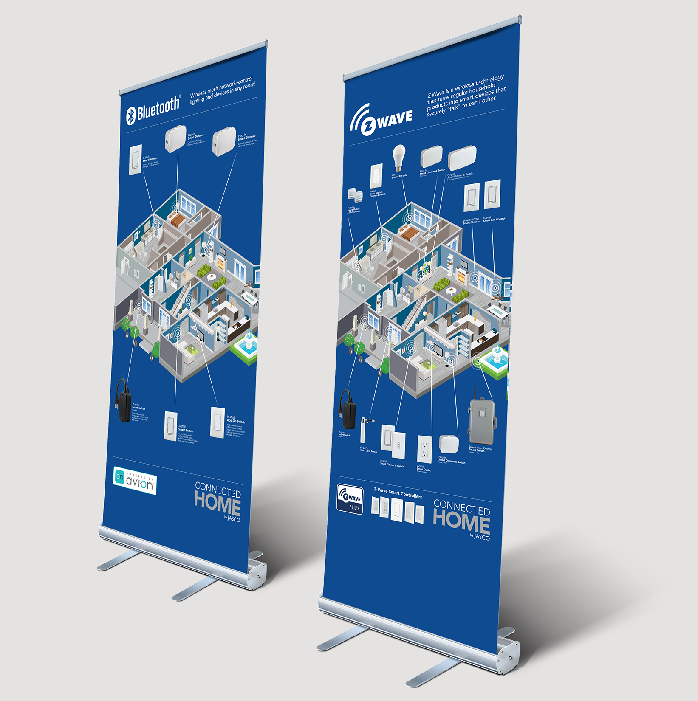

# Display Signage

A range of large-scale signage materials such as aisle violators, banner stands, and retail point-of-purchase displays or endcaps. Includes the design and production of sets for in-house sales meetings and tradeshows such as [CES](http://www.ces.tech/).

**For** Jasco Products Company  
**Type** Tradeshow signage, sales meeting support materials, retail endcaps and POP displays

  
  
  
  
  

