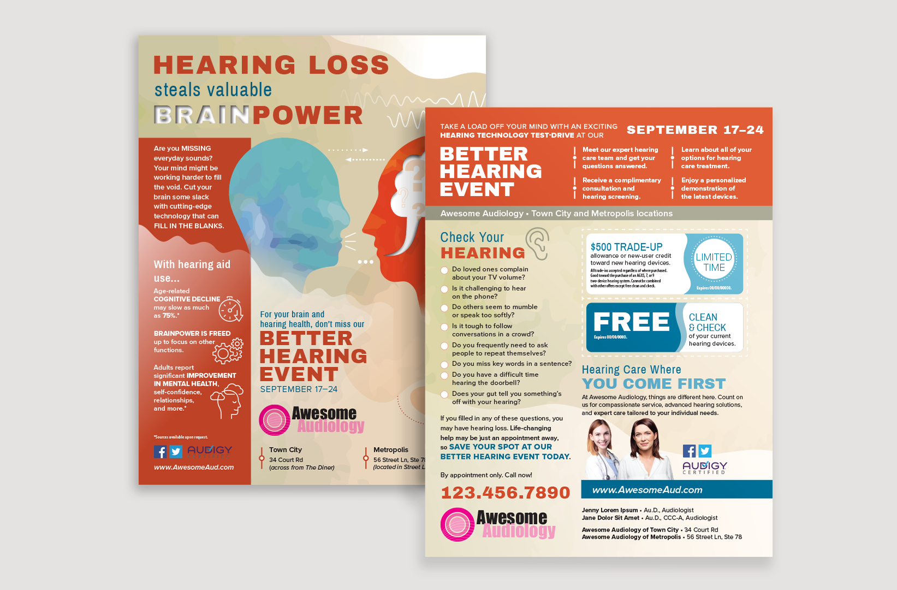
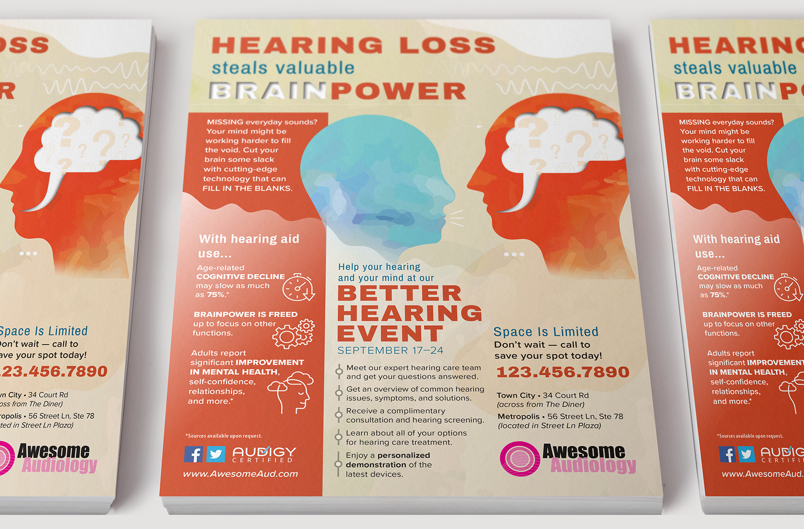
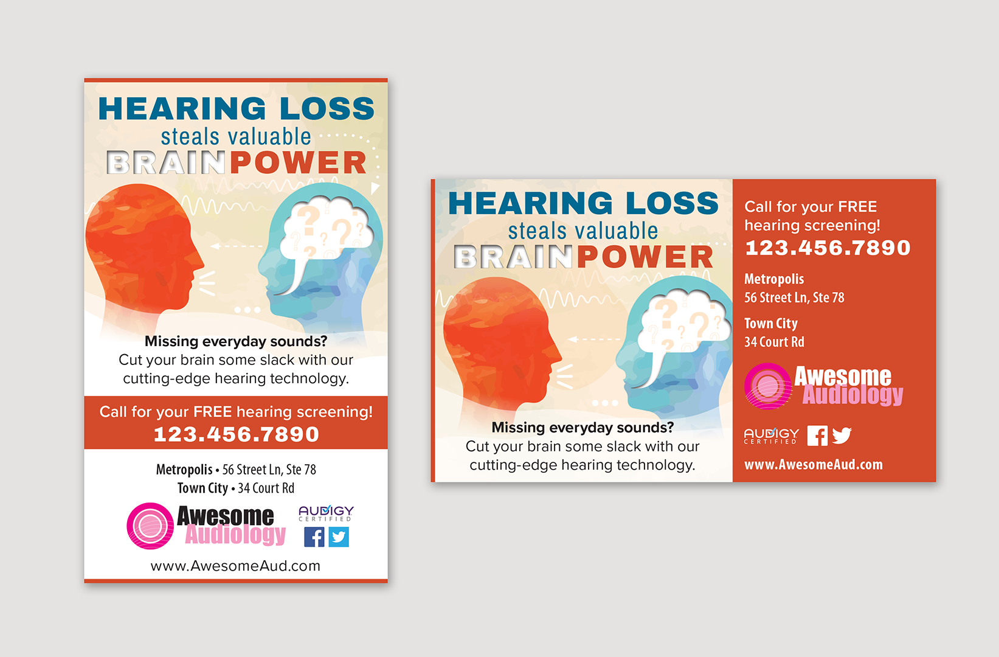
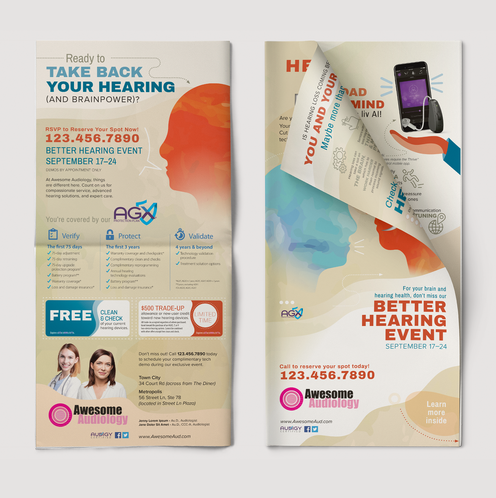
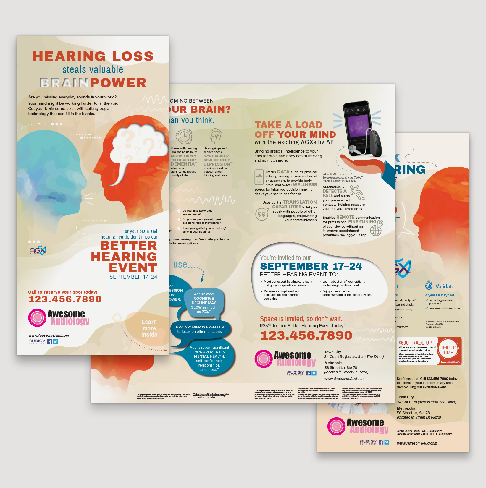
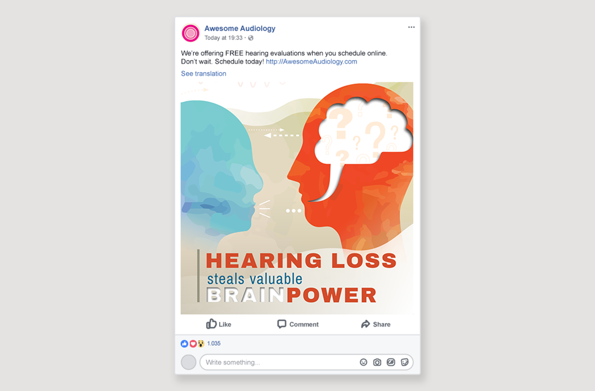

# Filling in the Blanks

Designed to target adults age 40+ who are invested in brain wellness to support their engaged lifestyles. The core strategy focuses on tapping into the prospects' desire to stay cognitively strong by showing them the potential negative consequences — in a modern, casual, and disarmingly authoritative way – of hearing loss function, and casting hearing tech as the solution. Blanks was created to be as visually vivid as possible for newsprint.

**Role** Graphic Designer, Concept Development  
**For** Audigy  
**Type** Creative Campaign  
**Copywriter** S. Hoover

  
  
  
  
  

