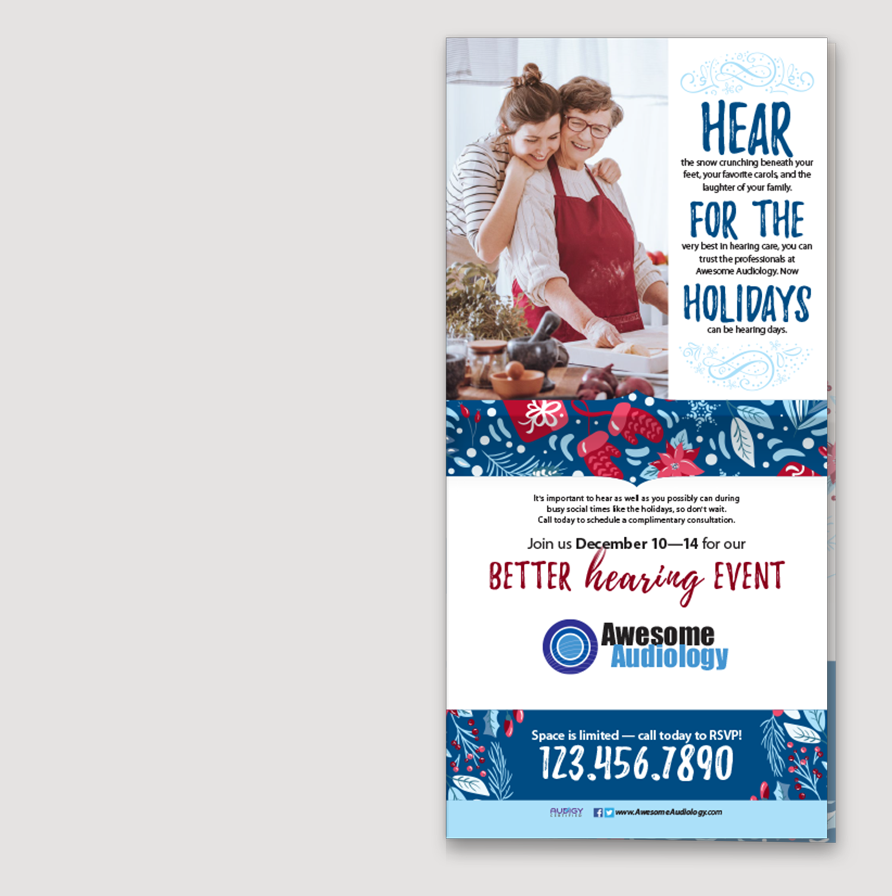
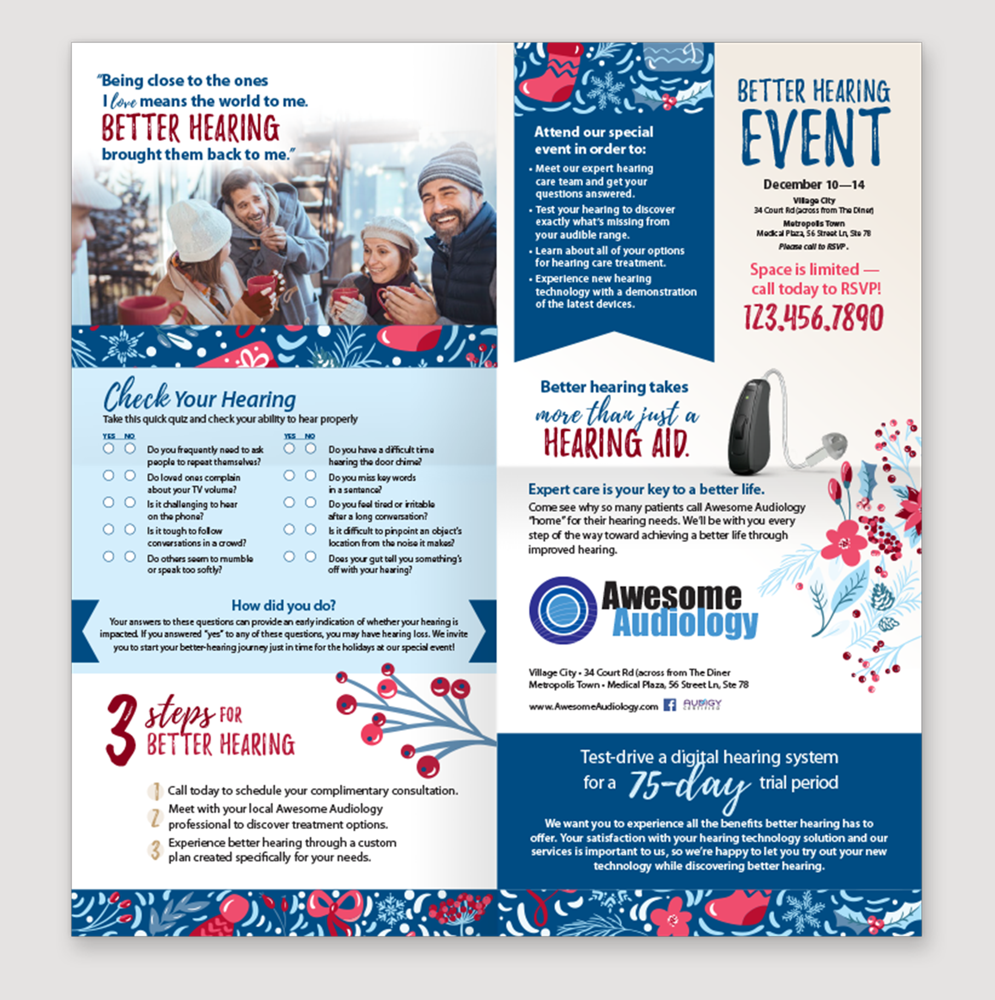
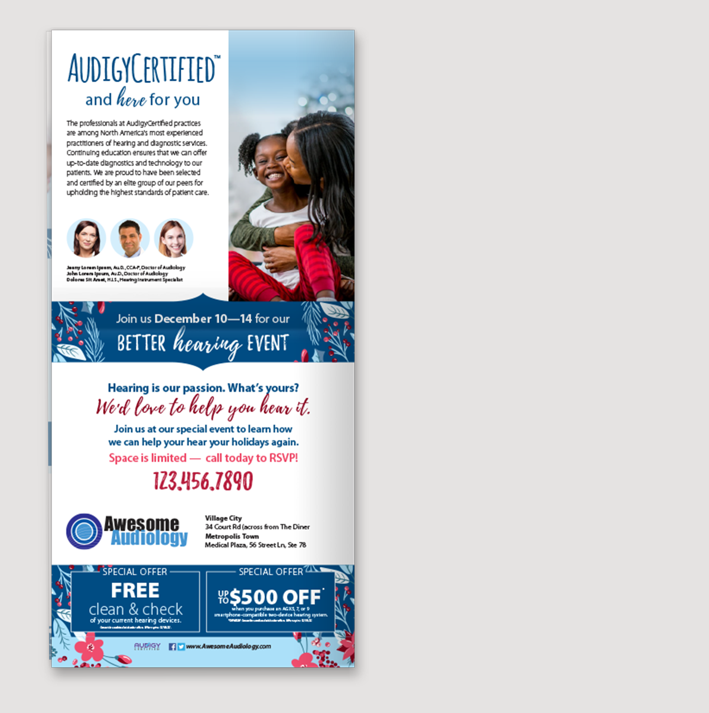
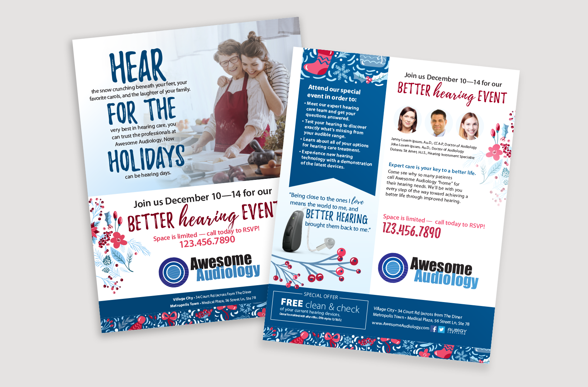
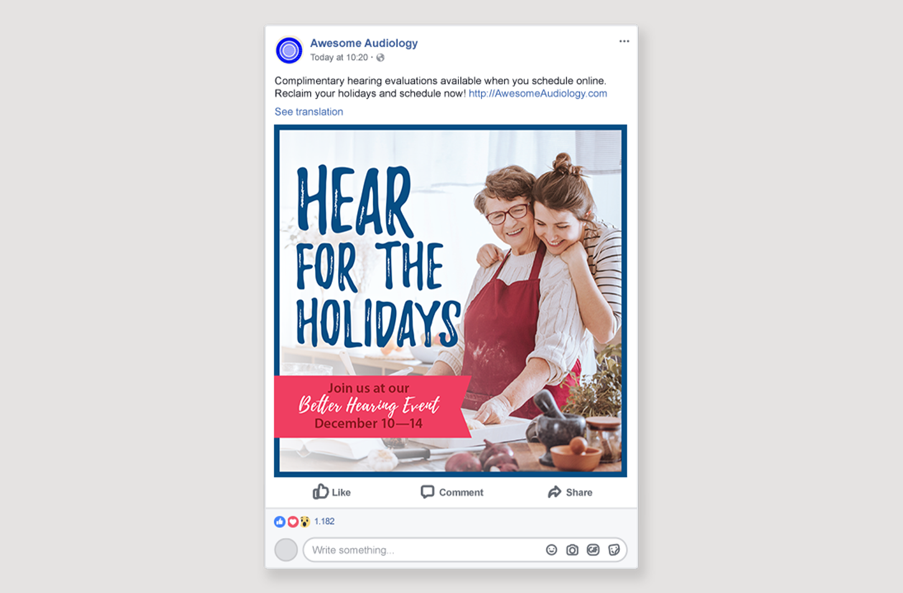

# Hear for the Holidays

The Hear for Holidays campaign was started from an old creative in the Audigy vault with information and designs that were signifcantly dated. I built this refreshed design to improve and refine upon the original seasonal concept, moving away from images of horses, carriages and quiet snowy forests, to feature more people and real-life scenarios of holiday interactions. The color choice was also updated from the classic red and green for Christmas, to a blue and red scheme to evoke a sense of winter holidays that were more inclusive of potential diversity of viewing audiences and their holiday traditions.

**Role** Graphic Designer, Concept Development  
**For** Audigy  
**Type** Creative Campaign  

  
  
  
  

