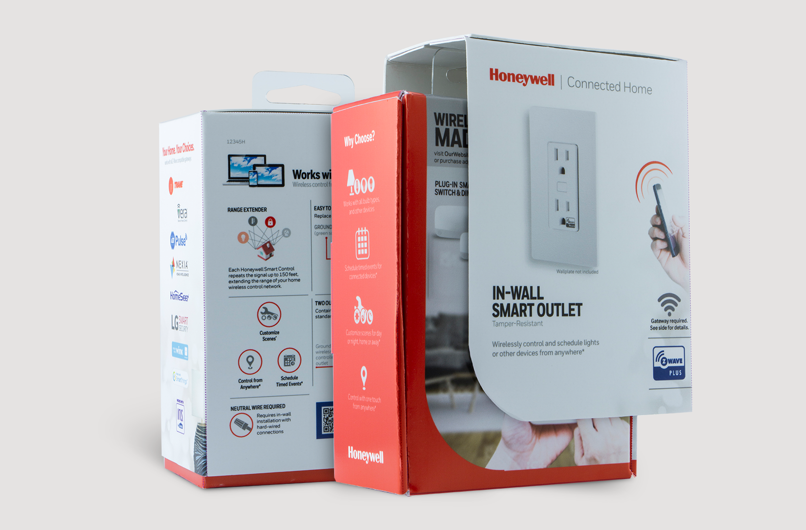
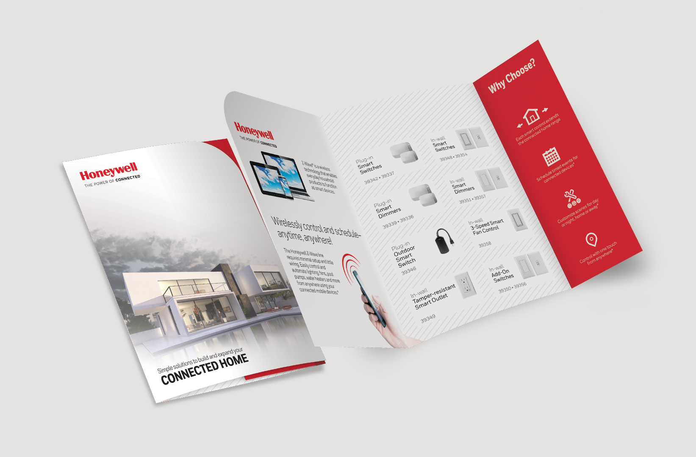
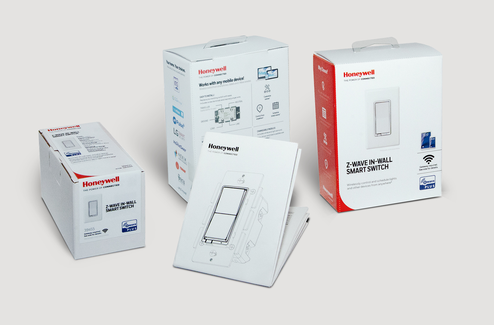
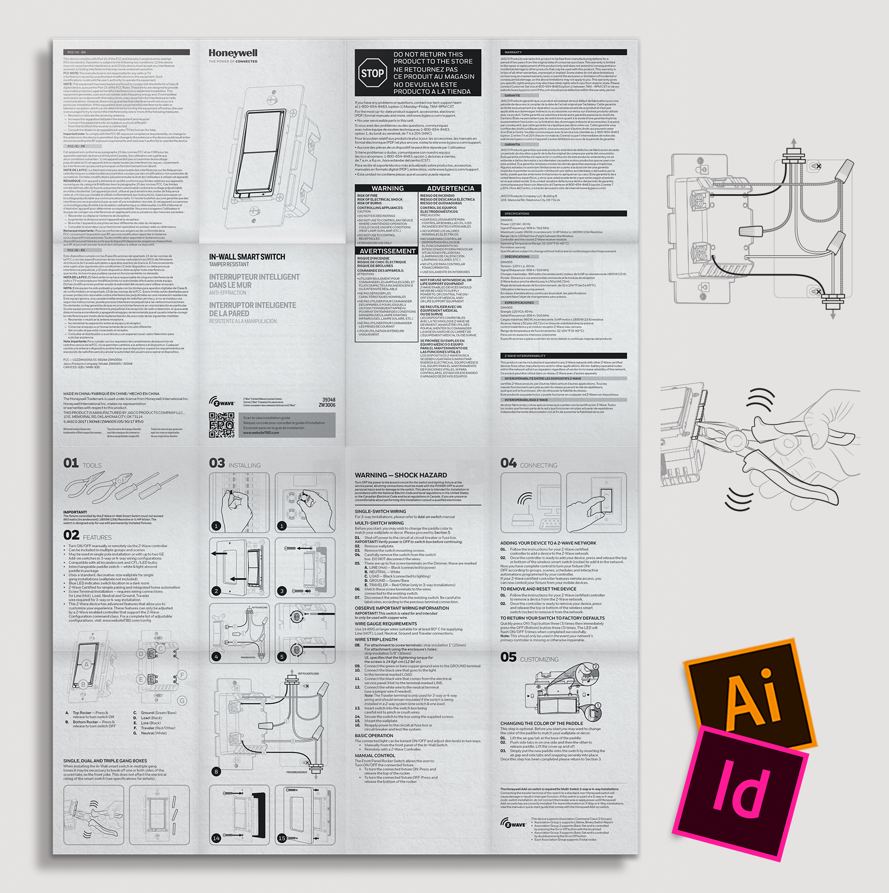

# Honeywell

The conceptual pitch for Honeywell's co-branded product as part of the Z-Wave lineup was the selling point for the partnership between Z-Wave and Honeywell within Jasco Products. The licensor had a lot of concerns about upholding their strong visual identity as part of a cobranded product. The conceptual pitch proved that we could visually address their concerns, and build out designs that brought harmony to the aesthetics and standards of both families of products, while also perfoming on a timeline that worked with their processes. The pitch was a win, and after several months of additional concepts, the deal was finalized.

**Role** Graphic Designer, Packaging Designer, Copywriter, Project Manager
**For** Jasco Products Company  
**Type** Conceptual Design & Retail Packaging

  
  
  
  