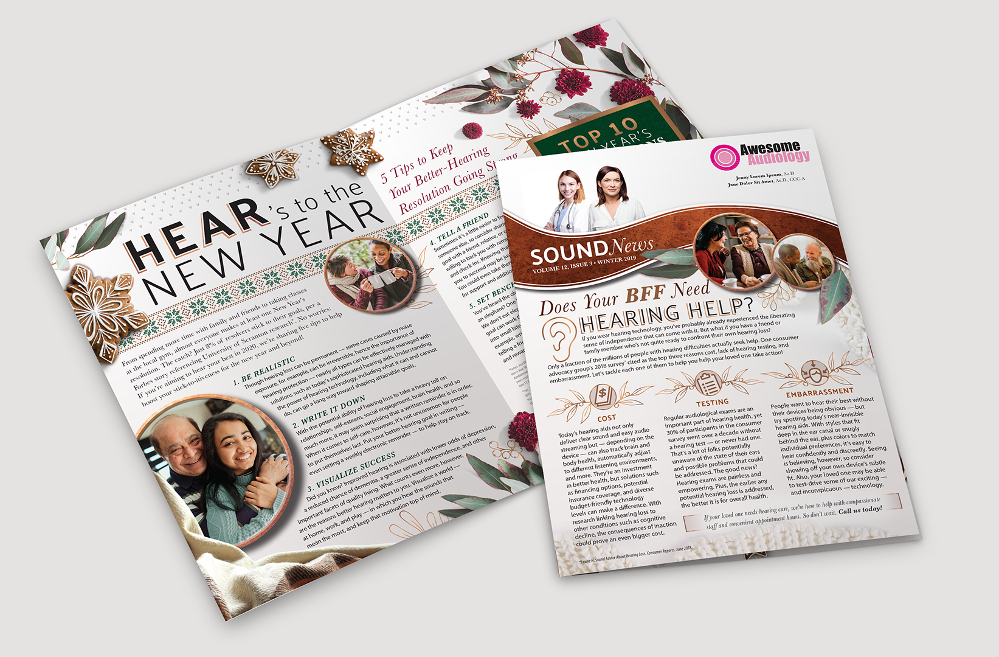
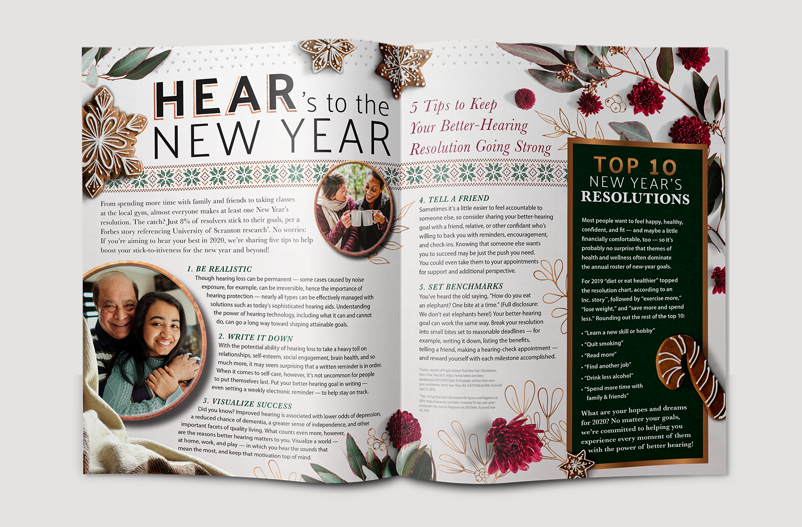
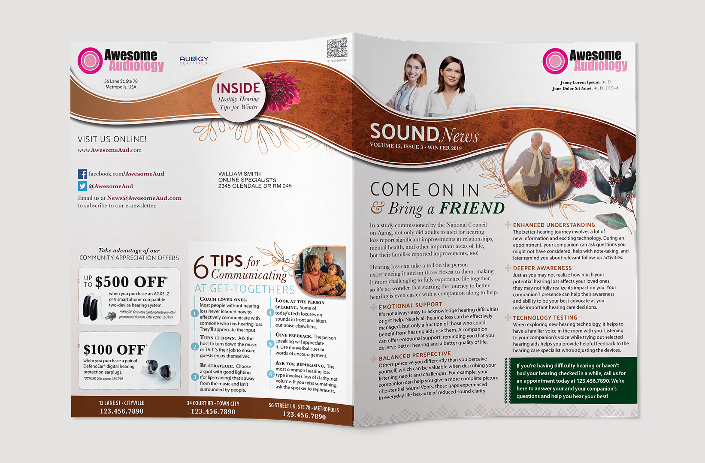
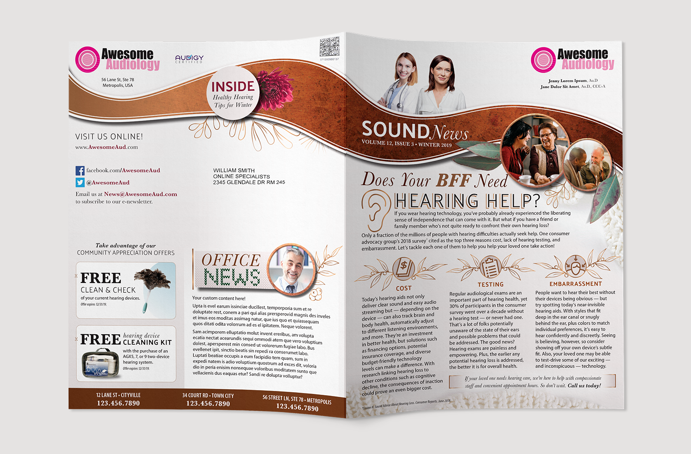
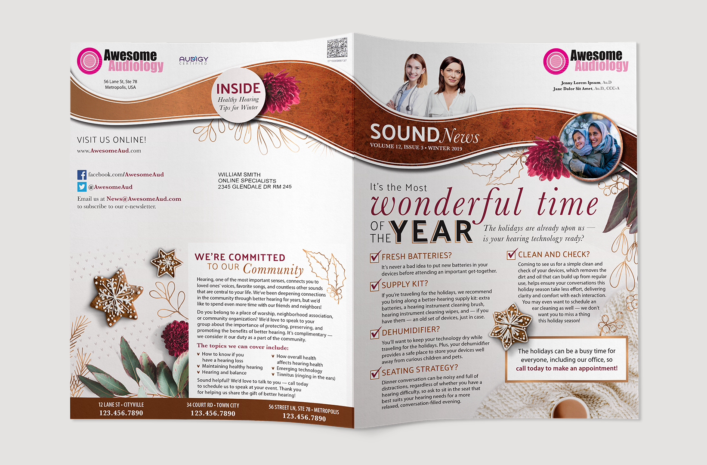
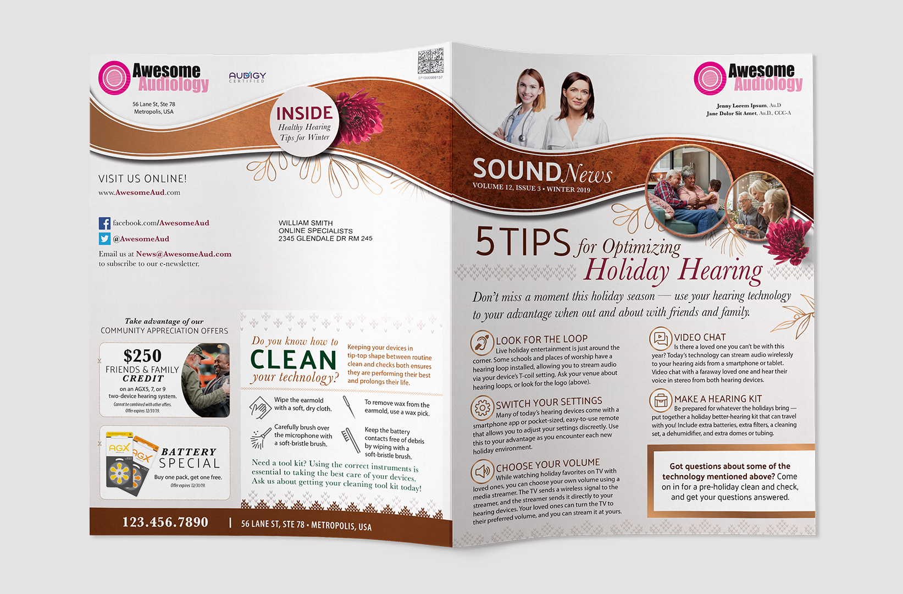
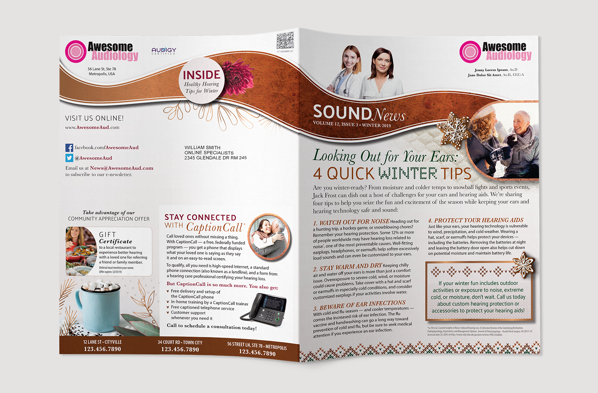
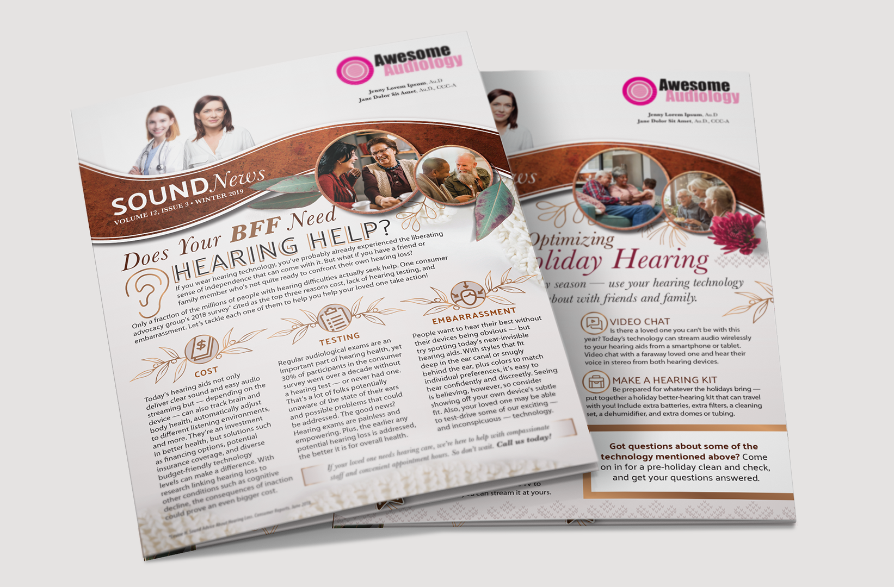

# Newsletter Winter 2019

Audigy’s SoundBytes Newsletter is printed mailing piece intended to boost confidence in the provider practice, and educate the consumer. The exterior spread is branded and customized for the practice, but the interior spread is static among all practices to reduce printing costs.

**Role** Lead Graphic Designer  
**For** Audigy  
**Type** Direct Mail

  
  
  
  
  
  
  

