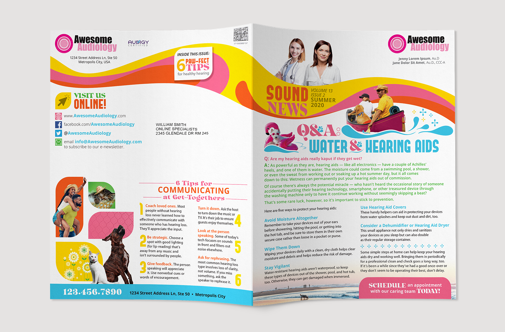
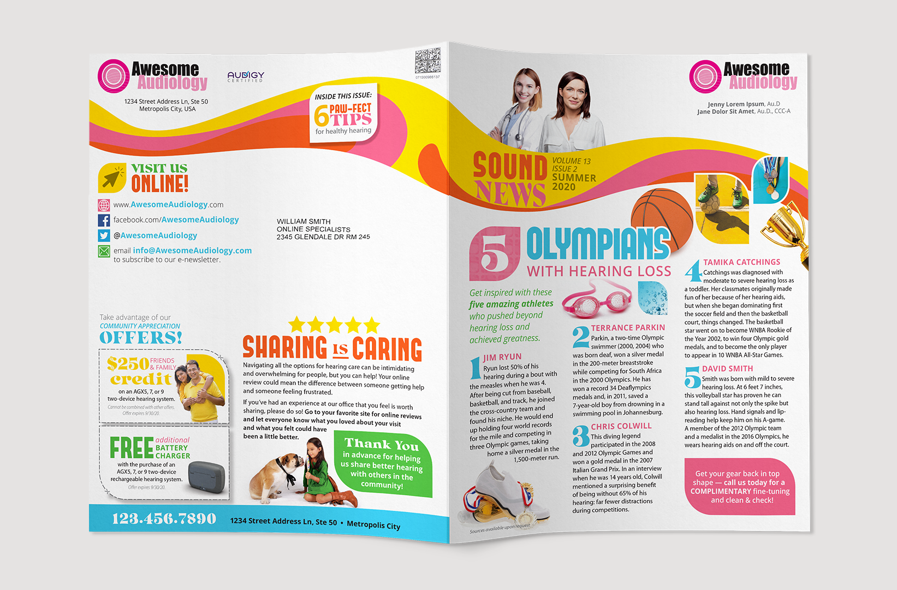

# Newsletter Winter 2019

Audigy’s SoundBytes Newsletter is printed mailing piece intended to boost confidence in the provider practice, and educate the consumer. The exterior spread is branded and customized for the practice, but the interior spread is static among all practices to reduce printing costs. The summer 2020 edition had content that was pet-focused, and utilized a 1960's-inspired design theme to resonate with the average reader demographic.

**Role** Lead Graphic Designer  
**For** Audigy  
**Type** Direct Mail

  
  
  
  
  
  

