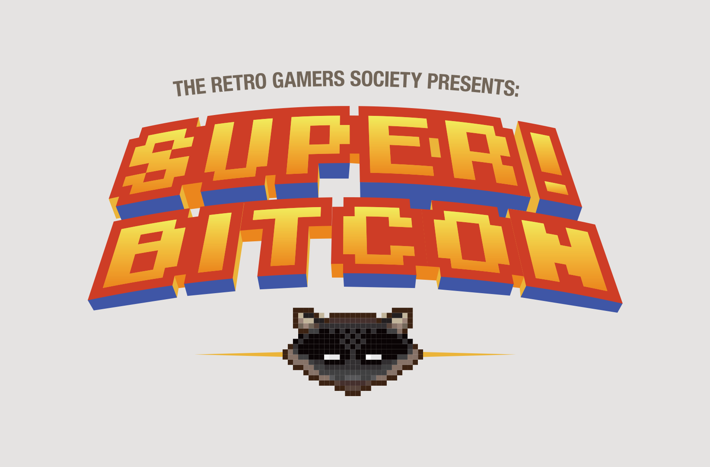
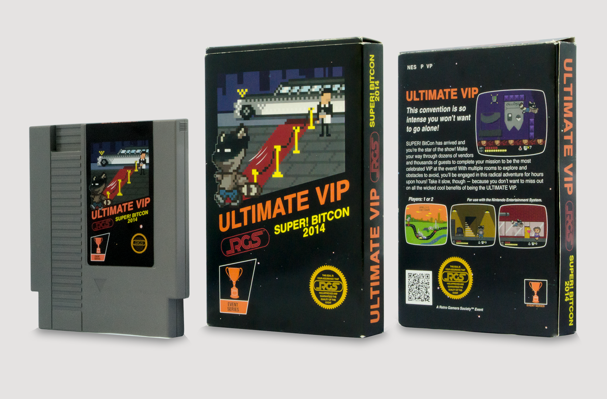
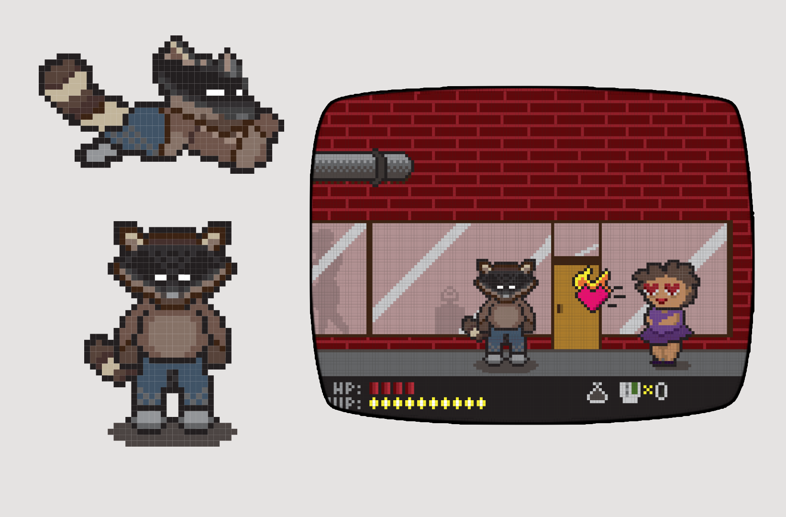
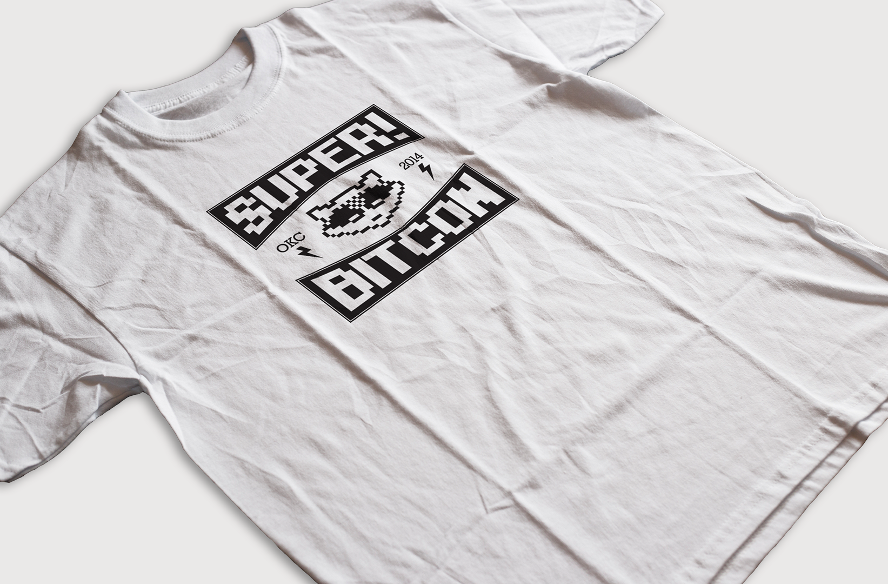
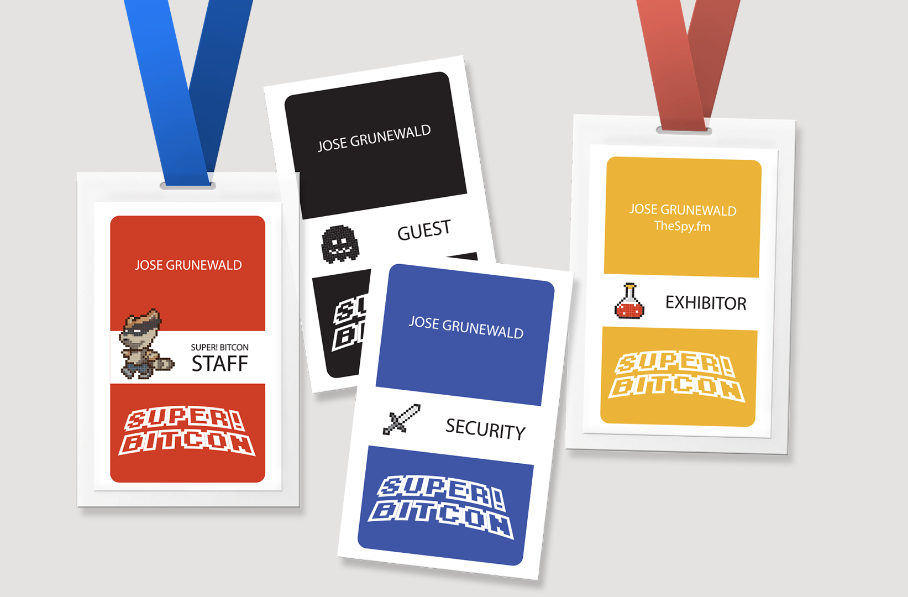
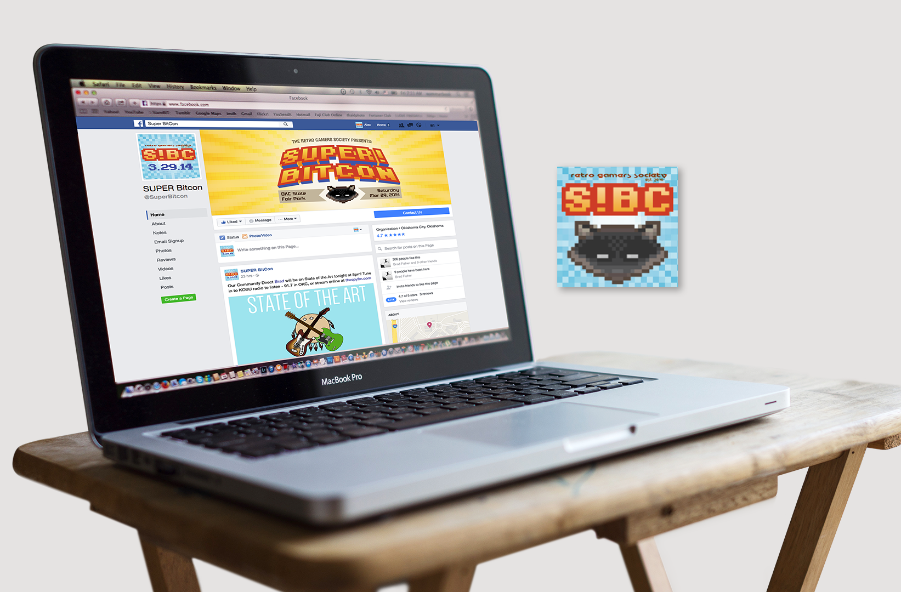

# Super! Bitcon

A new gaming convention trying to attract sponsors and attendees,
[Super! Bitcon](https://superbitcon.com/) wanted some novelty items. A premium [VIP package](http://retrogamersociety.com/super-bitcon-vip-packs-unveiled/) that imitated a classic Super Nintendo video game was created to drive giveaways and promotional contests. Additional throwback-style artworks for web use, and promotional materials was also created.

**Role** Graphic Designer, Illustrator  
**For** Retro Gamers Society  
**Type** Promotional Materials, Product Packaging

  

  
  
  

