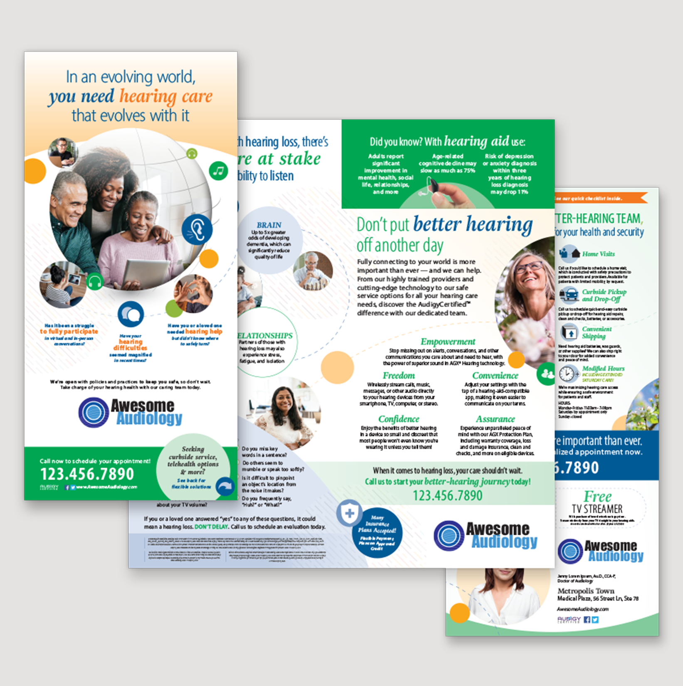
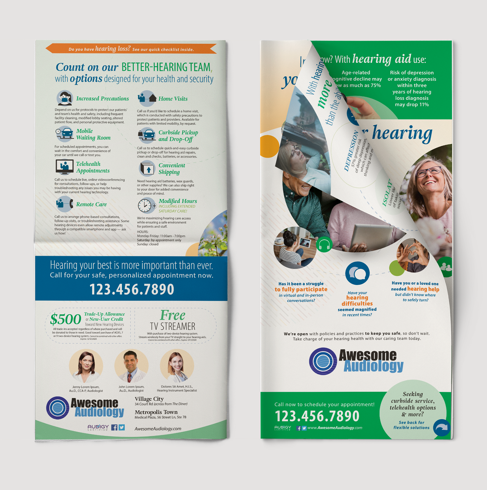
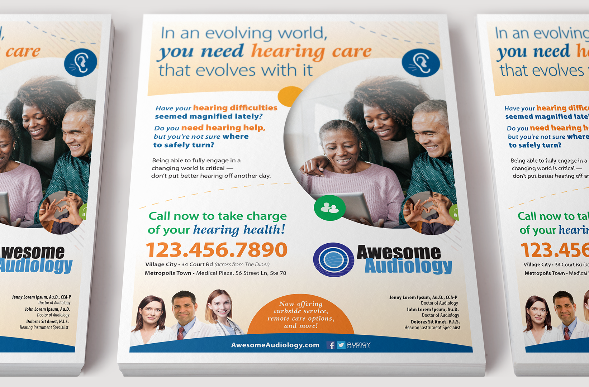
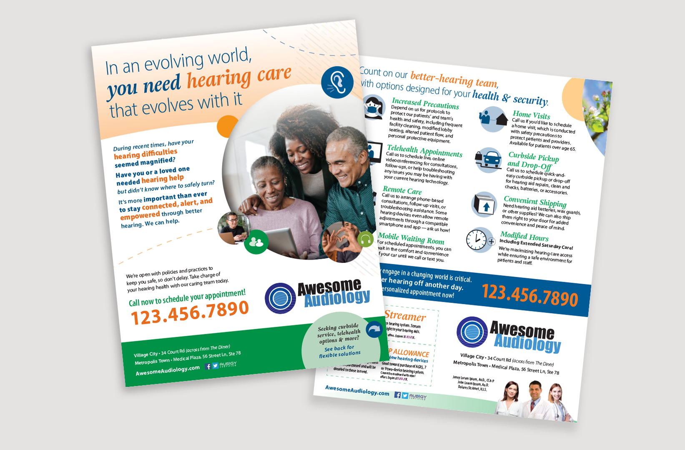
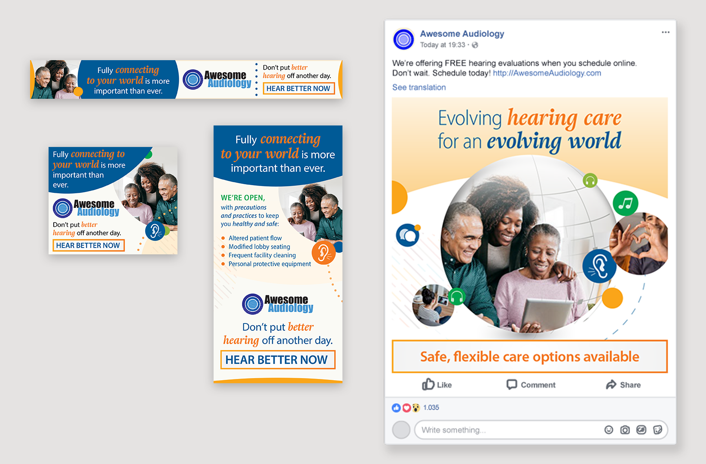

# Evolving World

Conceptually, the Evolving World campaign was a necessary response to assist in marketing towards patients and prospects who had safety top of mind as COVID dominated the news. The obstacles patients were navigating in light of the pandemic — managing life in a socially distanced, virtual world was brought to the forefront, in partnership with messaging that highlighted the practice's extra precautions towards personal safety for everyone.

Practically, this campaign was completed under high pressure and expectations. The impact of COVID-19 on Audigy reduced the graphic design team to just two people with no direct manager, and condensed the previously established 6+ month campaign process into a mere 3 months for full concept development, execution, and completion for nearly a dozen templated artworks.

This campaign proceeded to become the top performing campaign in multiple marketing zone within Audigy a total of 6 times within the first 18 months, and was deemed to have "stellar" results and "incredible performance" in the top performer.

**Role**
: Graphic Designer

**For**
: Audigy

**Type**
: Creative Campaign

**Collaborators**
: S. Hoover (copywriter), N. Miller (Director)

