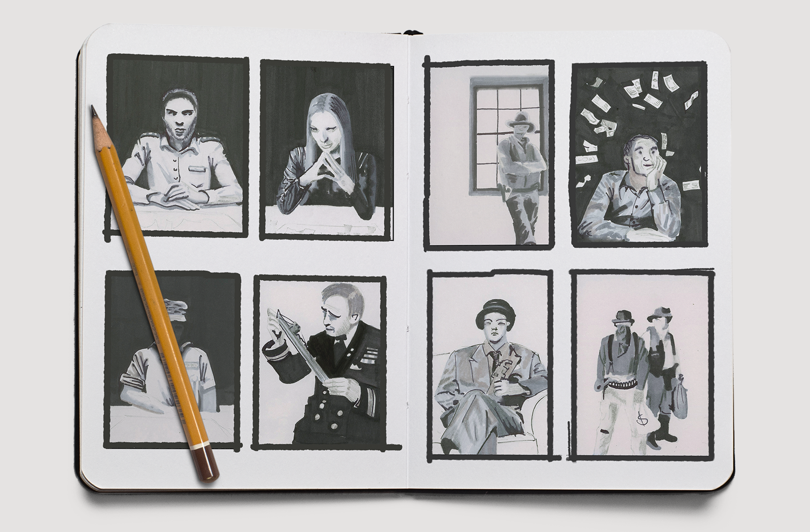

# Little Shoppe of Games

Little Shoppe of Games was a very small local board game store in the heart of Oklahoma City. They had a major competitor on the other side of the city, and wanted an eye-grabbing ad to run in the [local weekly newspaper](http://okgazette.com/), but could only afford a 1 color job.

**Role**
: Costuming, Photographer, Designer

**For**
: Little Shoppe of Games

**Type**
: 1-color Newspaper Advertisement

