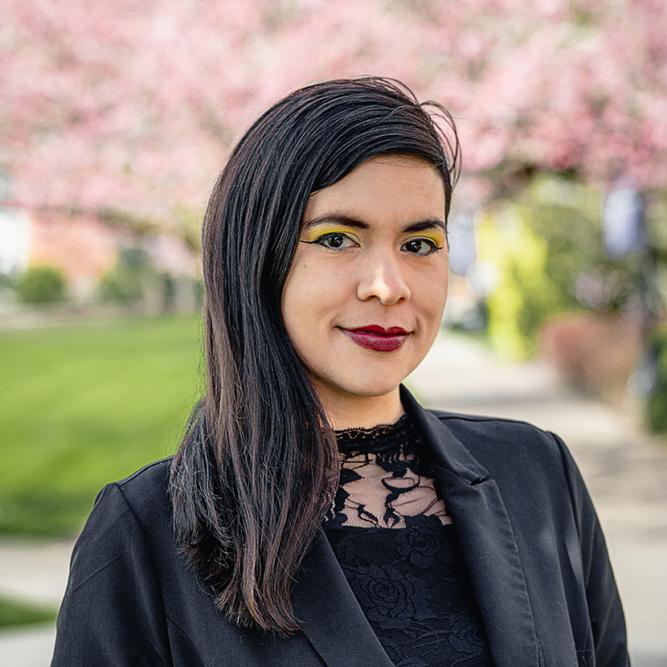

import { Split } from "../components";

<Split side="left">

> "Styles come and go. Good design is a language, not a style."" <cite>-Massimo Vignelli</cite>

</Split>

<Split side="right">

</Split>

#### About Me

If you were able to read the site thus far, you probably already know I'm Rachel Taylor, and a graphic designer. Outside being a designer I'm a pun-loving organizer and Dungeons & Dragons fan. I'm often founds in online spaces in the evenings offering advice about fostering healthy relationships and navigating complex emotions.

I spent my childhood in a variety of cultures and countries, which encouraged me to be passionate about communication, and how we establish the rules of meaning between each other as people. This interest is what led me to design as a career. I've since spent about a decade working in design, many of which have been as an in-house designer working with primarily print media. 

My philosophy for design is that, much like any language uses rules to order its elements so that they reliably convey meaning, so too does graphic design. I believe that it is vitally important to understand and manage how rules are used to more effectively build and elevate a work.

This drive for order led to working with established brands like GE, Disney, Honeywell building style guides and corralling creative teams to create consistent visuals. But I didn’t know where to go next. It wasn’t until a software engineer asked me why I wasn’t doing design systems for websites, that I found what I was really looking for.

I’m currently taking a period of growth to pursue learning about UX/UI and develop new skills as I deep diving into design systems. I’m always interested in exploring new opportunities and challenges. Reach out on [LinkedIn](https://www.linkedin.com/in/rtaylordesign/) to connect and hear a pun!

#### Awards
###### Gerber Process Development Award
**August 2019* • *April 2020**
Two-time recepient of the internal Audigy company award. This award is one of four awards presented quarterly to individuals within the company. This award is for recognition of  excellence in creating, steamlining, and maintaining processes that move the company forward. The recipient is an employee who has created simplicity and structure in the processes, and a known solution provider.

#### Education

**B.F.A. in Communication Design** • *emphasis in illustration*
Graduated Cum Laude from Oklahoma Christian University

#### Toolbox    
**Technical**
|                     |                   |
| ------------------- | ----------------- |
| Adobe Acrobat       | Adobe Bridge      |
| Adobe InDesign      | Adobe Photoshop   |
| Adobe Illustrator   | Adobe Lightroom   |
| Figma               | Premier Pro       |
| HTML & CSS          | Marketo           |

**Design & Editing**
|                     |                   |
| ------------------- | ----------------- |
| Illustrating        | DSLR Photography  |
| Typography          | Copy Writing      |
| Technical Writing   | Proofreading      |
| Video Editing       | Localization      |

**Office**
|                     |                   |
| ------------------- | ----------------- |
| Mac OS/ Windows     | Discord/ Slack    |
| MS Office           | G Suite           |
| Salesforce          | Remote Work       |
| Organization        | Process Management|
| Conflict Resolution | Leadership        |
| Leadership          | Training & Supervision |
| Active Listening    | Public Speaking |

**Learning goals for 2022**
- UE & UI Design
- Information Architecture
- Continued growth in Figma
- Continued growth in Git 
- Sewing & Costuming
- Revisiting acrylic painting